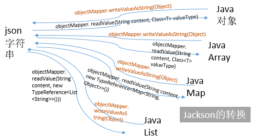

# Jackson 的使用




## 快速使用

### Demo1 - 一般使用
> [查看Demo1 源码](../src/main/java/dev/json/jackson/JsonSample.java)

Friend.java
```java
@Data
@AllArgsConstructor
@NoArgsConstructor
public class FriendDetail {
    String nickname;
    int age;
}
```

FriendDetail.java
```java
@Data
@NoArgsConstructor
@AllArgsConstructor
@JsonRootName("FriendDetail")
@JsonIgnoreProperties({"uselessProp1", "uselessProp3"})
public class FriendDetail {
    @JsonProperty("Name")
    private String name;
    @JsonProperty("Age")
    private int age;
    private String uselessProp1;
    @JsonIgnore
    private int uselessProp2;
    private String uselessProp3;
}
```

Person.java
```java
@Data
@NoArgsConstructor
@AllArgsConstructor
@JsonRootName("Person")
public class Person {
    @JsonProperty("Name")
    private String name;
    @JsonProperty("NickName")
    //@JacksonXmlText
    private String nickname;
    @JsonProperty("Age")
    private int age;
    @JsonProperty("IdentityCode")
    @JacksonXmlCData
    private String identityCode;
    @JsonProperty("Birthday")
    //@JacksonXmlProperty(isAttribute = true)
    @JsonFormat(pattern = "yyyy/MM/DD")
    private LocalDate birthday;
    @JsonProperty("Hobby")
    private List<String> hobbies;
}
```

使用例子 

```java
public class JsonSample {
    public static void main(String[] args) throws IOException {
        System.out.println("---------简单的映射---------");
        quickStart();
        System.out.println("---------集合的映射---------");
        collectionMapping();
        System.out.println("---------注解---------");
        annotationMapping();
        System.out.println("---------java8日期支持---------");
        java8DateTime();
    }

    static void quickStart() throws IOException {
        ObjectMapper mapper = new ObjectMapper();
        Friend friend = new Friend(){
            {
                this.setNickname("yitian");
                this.setAge(25);
            }
        };

        System.out.println(friend);
        //mapper.disable(SerializationFeature.FAIL_ON_EMPTY_BEANS);
        // 写为字符串
        String text = mapper.writeValueAsString(friend);
        // 写为文件
        mapper.writeValue(new File("friend.json"), friend);
        // 写为字节流
        byte[] bytes = mapper.writeValueAsBytes(friend);
        System.out.println(text);
        // 从字符串中读取
        Friend newFriend = mapper.readValue(text, Friend.class);
        // 从字节流中读取
        newFriend = mapper.readValue(bytes, Friend.class);
        // 从文件中读取
        newFriend = mapper.readValue(new File("friend.json"), Friend.class);
        System.out.println(newFriend);
    }

    static void collectionMapping() throws IOException {
        ObjectMapper mapper = new ObjectMapper();

        Map<String, Object> map = new HashMap<>();
        map.put("age", 25);
        map.put("name", "yitian");
        map.put("interests", new String[]{"pc games", "music"});

        String text = mapper.writeValueAsString(map);
        System.out.println(text);

        Map<String, Object> map2 = mapper.readValue(text, new TypeReference<Map<String, Object>>() {
        });
        System.out.println(map2);

        JsonNode root = mapper.readTree(text);
        String name = root.get("name").asText();
        int age = root.get("age").asInt();

        System.out.println("name:" + name + " age:" + age);
    }

    static void annotationMapping() throws IOException {
        ObjectMapper mapper = new ObjectMapper();
        mapper.enable(SerializationFeature.WRAP_ROOT_VALUE);
        mapper.disable(DeserializationFeature.FAIL_ON_UNKNOWN_PROPERTIES);
        FriendDetail fd = new FriendDetail("yitian", 25, "", 0, "");
        String text = mapper.writeValueAsString(fd);
        System.out.println(text);

        FriendDetail fd2 = mapper.readValue(text, FriendDetail.class);
        System.out.println(fd2);

    }

    static void java8DateTime() throws IOException {
        Person p1 = new Person("yitian", "易天", 25, "10000", LocalDate.of(1994, 1, 1),new ArrayList<String>(){
            {
                this.add("painting");
                this.add("piano");
                this.add("hiving");
            }
        });
        ObjectMapper mapper = new ObjectMapper()
                .registerModule(new JavaTimeModule())
                .registerModule(new ParameterNamesModule())
                .registerModule(new Jdk8Module());
        mapper.disable(SerializationFeature.WRITE_DATES_AS_TIMESTAMPS);
        String text = mapper.writeValueAsString(p1);
        System.out.println(text);

        Person p2 = mapper.readValue(text, Person.class);
        System.out.println(p2);
    }
}
```

结果输出

```java
---------简单的映射---------
Friend(nickname=yitian, age=25)
{"nickname":"yitian","age":25}
Friend(nickname=yitian, age=25)
---------集合的映射---------
{"name":"yitian","interests":["pc games","music"],"age":25}
{name=yitian, interests=[pc games, music], age=25}
name:yitian age:25
---------注解---------
{"FriendDetail":{"Name":"yitian","Age":25}}
FriendDetail(name=null, age=0, uselessProp1=null, uselessProp2=0, uselessProp3=null)
---------java8日期支持---------
{"Name":"yitian","NickName":"易天","Age":25,"IdentityCode":"10000","Birthday":"1994/01/01","Hobby":["painting","piano","hiving"]}
Person(name=yitian, nickname=易天, age=25, identityCode=10000, birthday=1994-01-01, hobbies=[painting, piano, hiving])
```

### Demo2 - 复杂对象支持(属性嵌套)
> [查看Demo2 源码](../src/main/java/dev/json/jackson/ComplexSample.java)


Student.java
```java
@Data
@NoArgsConstructor
@AllArgsConstructor
public class Student {
    @JsonProperty("stuId")
    private String id;

    @JsonProperty(value = "age",defaultValue = "18")
    @JsonIgnore
    private int age;

    @JsonProperty("friends")
    private Friend[] friends;
}
```

复杂对象支持例子

```java
    static void complexJavaObject() throws IOException {
        ObjectMapper mapper = new ObjectMapper();
        List<Friend> friendList = new ArrayList<>();
        friendList.add(new Friend("zhangming",12));
        friendList.add(new Friend("Hangzhong",14));
        friendList.add(new Friend("SanYixian",17));
        Student stu1 = new Student("23222",21,friendList.toArray(new Friend[0]));
        System.out.println("stu1: " + stu1);
        String text = mapper.writeValueAsString(stu1);
        System.out.println(text);
        Student stu2 = mapper.readValue(text,Student.class);
        System.out.println("stu2: " + stu2);
    }
```

结果输出
```
stu1: Student(id=23222, age=21, friends=[Friend(nickname=zhangming, age=12), Friend(nickname=Hangzhong, age=14), Friend(nickname=SanYixian, age=17)])
{"age":21,"stuId":"23222","friends":[{"nickname":"zhangming","age":12},{"nickname":"Hangzhong","age":14},{"nickname":"SanYixian","age":17}]}
stu2: Student(id=23222, age=21, friends=[Friend(nickname=zhangming, age=12), Friend(nickname=Hangzhong, age=14), Friend(nickname=SanYixian, age=17)])
```

### Demo3 - 操作Json字符串

```
JsonNode rootOne = null;
try {
    rootOne = mapper.readTree(mapper.writeValueAsString(rspOne.getEntity()));
} catch (JsonProcessingException e) {
    System.out.println(e.getMessage());
}

JsonNode msgNode = rootOne.get("msg"); 
```

将Json字符串以树的形式读入成一个 JsonNode,使用 rootOne.get(fieldName) 即可读取到相应节点。再进行相应操作。参见[Demo](../src/main/java/dev/json/jackson/crm/JacksonProblem.java)

## Jackson注解

## 处理JSON

### 简单映射
用Lombok设置一个简单的Java类。

```java
@Data
@AllArgsConstructor
@NoArgsConstructor
public class Friend {
    private String nickname;
    private int age;
}
```


处理JSON数据.首先需要一个ObjectMapper对象，序列化和反序列化都需要它。
```java
    ObjectMapper mapper = new ObjectMapper();
    Friend friend = new Friend("yitian", 25);
    
    // 写为字符串
    String text = mapper.writeValueAsString(friend);
    // 写为文件
    mapper.writeValue(new File("friend.json"), friend);
    // 写为字节流
    byte[] bytes = mapper.writeValueAsBytes(friend);
    System.out.println(text);
    // 从字符串中读取
    Friend newFriend = mapper.readValue(text, Friend.class);
    // 从字节流中读取
    newFriend = mapper.readValue(bytes, Friend.class);
    // 从文件中读取
    newFriend = mapper.readValue(new File("friend.json"), Friend.class);
    System.out.println(newFriend);
```

程序结果如下:

```java
{"nickname":"yitian","age":25}
Friend(nickname=yitian, age=25)
```

### 集合的映射
除了使用Java类进行映射之外，还可以直接使用Map和List等Java集合组织JSON数据，在需要的时候可以使用readTree方法直接读取JSON中的某个属性值。需要注意的是从JSON转换为Map对象的时候，由于Java的类型擦除，所以类型需要手动用new TypeReference<T>给出。
```java
    ObjectMapper mapper = new ObjectMapper();
    
    Map<String, Object> map = new HashMap<>();
    map.put("age", 25);
    map.put("name", "yitian");
    map.put("interests", new String[]{"pc games", "music"});
    
    String text = mapper.writeValueAsString(map);
    System.out.println(text);
    
    Map<String, Object> map2 = mapper.readValue(text, new TypeReference<Map<String, Object>>() {
    });
    System.out.println(map2);
    
    JsonNode root = mapper.readTree(text);
    String name = root.get("name").asText();
    int age = root.get("age").asInt();
    
    System.out.println("name:" + name + " age:" + age);
```
    
程序结果如下。

```java
{"name":"yitian","interests":["pc games","music"],"age":25}
{name=yitian, interests=[pc games, music], age=25}
name:yitian age:25
```

### Jackson配置

Jackson预定义了一些配置，通过启用和禁用某些属性可以修改Jackson运行的某些行为。详细文档参考[JacksonFeatures](https://github.com/FasterXML/jackson-databind/wiki/JacksonFeatures)。

configure方法接受配置名和要设置的值，Jackson 2.5版本新加的enable和disable方法则直接启用和禁用相应属性，推荐使用后面两个方法。

1. 常见配置

    ```java
    // 美化输出
    mapper.enable(SerializationFeature.INDENT_OUTPUT);
    // 允许序列化空的POJO类
    // （否则会抛出异常）
    mapper.disable(SerializationFeature.FAIL_ON_EMPTY_BEANS);
    // 把java.util.Date, Calendar输出为数字（时间戳）
    mapper.disable(SerializationFeature.WRITE_DATES_AS_TIMESTAMPS);

    // 在遇到未知属性的时候不抛出异常
    mapper.disable(DeserializationFeature.FAIL_ON_UNKNOWN_PROPERTIES);
    // 强制JSON 空字符串("")转换为null对象值:
    mapper.enable(DeserializationFeature.ACCEPT_EMPTY_STRING_AS_NULL_OBJECT);

    // 在JSON中允许C/C++ 样式的注释(非标准，默认禁用)
    mapper.configure(JsonParser.Feature.ALLOW_COMMENTS, true);
    // 允许没有引号的字段名（非标准）
    mapper.configure(JsonParser.Feature.ALLOW_UNQUOTED_FIELD_NAMES, true);
    // 允许单引号（非标准）
    mapper.configure(JsonParser.Feature.ALLOW_SINGLE_QUOTES, true);
    // 强制转义非ASCII字符
    mapper.configure(JsonGenerator.Feature.ESCAPE_NON_ASCII, true);
    // 将内容包裹为一个JSON属性，属性名由@JsonRootName注解指定
    mapper.configure(SerializationFeature.WRAP_ROOT_VALUE, true);
    ```

2. 默认情况下，Jackson将空对象序列化为null，要序列化为空字符串。
    ```
    // 将空对象序列化为空字符串，而不是null
    mapper.getSerializerProvider().setNullValueSerializer(new JsonSerializer<Object>() {
        @Override
        public void serialize(Object value, JsonGenerator gen, SerializerProvider serializers) throws IOException {
            gen.writeString("");
        }
    });
    ```
    > 这对 JsonArray很重要，Jackson 认为 [null] 中 null 也是一个元素，这会导致错误