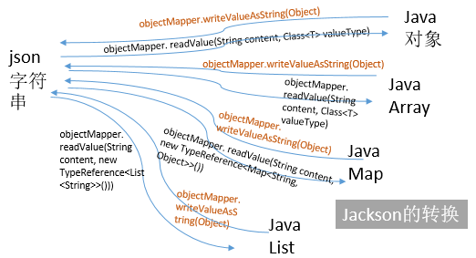

# Jackson 的使用



## 快速使用
### Demo1 - 一般使用

Friend.java
```java
@Data
@AllArgsConstructor
@NoArgsConstructor
public class FriendDetail {
    String nickname;
    int age;
}
```

FriendDetail.java
```java
@Data
@NoArgsConstructor
@AllArgsConstructor
@JsonRootName("FriendDetail")
@JsonIgnoreProperties({"uselessProp1", "uselessProp3"})
public class FriendDetail {
    @JsonProperty("Name")
    private String name;
    @JsonProperty("Age")
    private int age;
    private String uselessProp1;
    @JsonIgnore
    private int uselessProp2;
    private String uselessProp3;
}
```

Person.java
```java
@Data
@NoArgsConstructor
@AllArgsConstructor
@JsonRootName("Person")
public class Person {
    @JsonProperty("Name")
    private String name;
    @JsonProperty("NickName")
    //@JacksonXmlText
    private String nickname;
    @JsonProperty("Age")
    private int age;
    @JsonProperty("IdentityCode")
    @JacksonXmlCData
    private String identityCode;
    @JsonProperty("Birthday")
    //@JacksonXmlProperty(isAttribute = true)
    @JsonFormat(pattern = "yyyy/MM/DD")
    private LocalDate birthday;
    @JsonProperty("Hobby")
    private List<String> hobbies;
}
```

使用例子 

```java
public class JsonSample {
    public static void main(String[] args) throws IOException {
        System.out.println("---------简单的映射---------");
        quickStart();
        System.out.println("---------集合的映射---------");
        collectionMapping();
        System.out.println("---------注解---------");
        annotationMapping();
        System.out.println("---------java8日期支持---------");
        java8DateTime();
    }

    static void quickStart() throws IOException {
        ObjectMapper mapper = new ObjectMapper();
        Friend friend = new Friend(){
            {
                this.setNickname("yitian");
                this.setAge(25);
            }
        };

        System.out.println(friend);
        //mapper.disable(SerializationFeature.FAIL_ON_EMPTY_BEANS);
        // 写为字符串
        String text = mapper.writeValueAsString(friend);
        // 写为文件
        mapper.writeValue(new File("friend.json"), friend);
        // 写为字节流
        byte[] bytes = mapper.writeValueAsBytes(friend);
        System.out.println(text);
        // 从字符串中读取
        Friend newFriend = mapper.readValue(text, Friend.class);
        // 从字节流中读取
        newFriend = mapper.readValue(bytes, Friend.class);
        // 从文件中读取
        newFriend = mapper.readValue(new File("friend.json"), Friend.class);
        System.out.println(newFriend);
    }

    static void collectionMapping() throws IOException {
        ObjectMapper mapper = new ObjectMapper();

        Map<String, Object> map = new HashMap<>();
        map.put("age", 25);
        map.put("name", "yitian");
        map.put("interests", new String[]{"pc games", "music"});

        String text = mapper.writeValueAsString(map);
        System.out.println(text);

        Map<String, Object> map2 = mapper.readValue(text, new TypeReference<Map<String, Object>>() {
        });
        System.out.println(map2);

        JsonNode root = mapper.readTree(text);
        String name = root.get("name").asText();
        int age = root.get("age").asInt();

        System.out.println("name:" + name + " age:" + age);
    }

    static void annotationMapping() throws IOException {
        ObjectMapper mapper = new ObjectMapper();
        mapper.enable(SerializationFeature.WRAP_ROOT_VALUE);
        mapper.disable(DeserializationFeature.FAIL_ON_UNKNOWN_PROPERTIES);
        FriendDetail fd = new FriendDetail("yitian", 25, "", 0, "");
        String text = mapper.writeValueAsString(fd);
        System.out.println(text);

        FriendDetail fd2 = mapper.readValue(text, FriendDetail.class);
        System.out.println(fd2);

    }

    static void java8DateTime() throws IOException {
        Person p1 = new Person("yitian", "易天", 25, "10000", LocalDate.of(1994, 1, 1),new ArrayList<String>(){
            {
                this.add("painting");
                this.add("piano");
                this.add("hiving");
            }
        });
        ObjectMapper mapper = new ObjectMapper()
                .registerModule(new JavaTimeModule())
                .registerModule(new ParameterNamesModule())
                .registerModule(new Jdk8Module());
        mapper.disable(SerializationFeature.WRITE_DATES_AS_TIMESTAMPS);
        String text = mapper.writeValueAsString(p1);
        System.out.println(text);

        Person p2 = mapper.readValue(text, Person.class);
        System.out.println(p2);
    }
}
```

结果输出

```java
---------简单的映射---------
Friend(nickname=yitian, age=25)
{"nickname":"yitian","age":25}
Friend(nickname=yitian, age=25)
---------集合的映射---------
{"name":"yitian","interests":["pc games","music"],"age":25}
{name=yitian, interests=[pc games, music], age=25}
name:yitian age:25
---------注解---------
{"FriendDetail":{"Name":"yitian","Age":25}}
FriendDetail(name=null, age=0, uselessProp1=null, uselessProp2=0, uselessProp3=null)
---------java8日期支持---------
{"Name":"yitian","NickName":"易天","Age":25,"IdentityCode":"10000","Birthday":"1994/01/01","Hobby":["painting","piano","hiving"]}
Person(name=yitian, nickname=易天, age=25, identityCode=10000, birthday=1994-01-01, hobbies=[painting, piano, hiving])
```
### Demo2 - 复杂对象支持

Student.java
```java
@Data
@NoArgsConstructor
@AllArgsConstructor
public class Student {
    @JsonProperty("stuId")
    private String id;

    @JsonProperty(value = "age",defaultValue = "18")
    @JsonIgnore
    private int age;

    @JsonProperty("friends")
    private Friend[] friends;
}
```

复杂对象支持例子

```java
    static void complexJavaObject() throws IOException {
        ObjectMapper mapper = new ObjectMapper();
        List<Friend> friendList = new ArrayList<>();
        friendList.add(new Friend("zhangming",12));
        friendList.add(new Friend("Hangzhong",14));
        friendList.add(new Friend("SanYixian",17));
        Student stu1 = new Student("23222",21,friendList.toArray(new Friend[0]));
        System.out.println("stu1: " + stu1);
        String text = mapper.writeValueAsString(stu1);
        System.out.println(text);
        Student stu2 = mapper.readValue(text,Student.class);
        System.out.println("stu2: " + stu2);
    }
```

结果输出
```
stu1: Student(id=23222, age=21, friends=[Friend(nickname=zhangming, age=12), Friend(nickname=Hangzhong, age=14), Friend(nickname=SanYixian, age=17)])
{"age":21,"stuId":"23222","friends":[{"nickname":"zhangming","age":12},{"nickname":"Hangzhong","age":14},{"nickname":"SanYixian","age":17}]}
stu2: Student(id=23222, age=21, friends=[Friend(nickname=zhangming, age=12), Friend(nickname=Hangzhong, age=14), Friend(nickname=SanYixian, age=17)])
```

## Jackson注解
Jackson类库包含了很多注解，可以让快速建立Java类与JSON之间的关系。详细文档可以参考Jackson-Annotations。下面介绍一下常用的。

- 属性命名
    - @JsonProperty注解指定一个属性用于JSON映射，默认情况下映射的JSON属性与注解的属性名称相同，使用该注解的value值修改JSON属性名，该注解还有一个index属性指定生成JSON属性的顺序，如果有必要的话。
- 属性包含: 管理在映射JSON的时候包含或排除某些属性。
    - @JsonIgnore注解用于排除某个属性，这样该属性就不会被Jackson序列化和反序列化。
    - @JsonIgnoreProperties注解是类注解。在序列化为JSON的时候，
    - @JsonIgnoreProperties({"prop1", "prop2"})会忽略pro1和pro2两个属性。在从JSON反序列化为Java类的时候，@JsonIgnoreProperties(ignoreUnknown=true)会忽略所有没有Getter和Setter的属性。该注解在Java类和JSON不完全匹配的时候很有用。
    - @JsonIgnoreType也是类注解，会排除所有指定类型的属性。
- 序列化
    - @JsonPropertyOrder和@JsonProperty的index属性类似，指定属性序列化时的顺序。
    - @JsonRootName注解用于指定JSON根属性的名称。

## 处理JSON
### 简单映射
用Lombok设置一个简单的Java类。

```java
@Data
@AllArgsConstructor
@NoArgsConstructor
public class Friend {
    private String nickname;
    private int age;
}
```


处理JSON数据.首先需要一个ObjectMapper对象，序列化和反序列化都需要它。
```java
    ObjectMapper mapper = new ObjectMapper();
    Friend friend = new Friend("yitian", 25);
    
    // 写为字符串
    String text = mapper.writeValueAsString(friend);
    // 写为文件
    mapper.writeValue(new File("friend.json"), friend);
    // 写为字节流
    byte[] bytes = mapper.writeValueAsBytes(friend);
    System.out.println(text);
    // 从字符串中读取
    Friend newFriend = mapper.readValue(text, Friend.class);
    // 从字节流中读取
    newFriend = mapper.readValue(bytes, Friend.class);
    // 从文件中读取
    newFriend = mapper.readValue(new File("friend.json"), Friend.class);
    System.out.println(newFriend);
```

程序结果如下:

```java
{"nickname":"yitian","age":25}
Friend(nickname=yitian, age=25)
```

### 集合的映射
除了使用Java类进行映射之外，还可以直接使用Map和List等Java集合组织JSON数据，在需要的时候可以使用readTree方法直接读取JSON中的某个属性值。需要注意的是从JSON转换为Map对象的时候，由于Java的类型擦除，所以类型需要手动用new TypeReference<T>给出。
```java
    ObjectMapper mapper = new ObjectMapper();
    
    Map<String, Object> map = new HashMap<>();
    map.put("age", 25);
    map.put("name", "yitian");
    map.put("interests", new String[]{"pc games", "music"});
    
    String text = mapper.writeValueAsString(map);
    System.out.println(text);
    
    Map<String, Object> map2 = mapper.readValue(text, new TypeReference<Map<String, Object>>() {
    });
    System.out.println(map2);
    
    JsonNode root = mapper.readTree(text);
    String name = root.get("name").asText();
    int age = root.get("age").asInt();
    
    System.out.println("name:" + name + " age:" + age);
```
    
程序结果如下。

```java
{"name":"yitian","interests":["pc games","music"],"age":25}
{name=yitian, interests=[pc games, music], age=25}
name:yitian age:25
```

### Jackson配置
Jackson预定义了一些配置，通过启用和禁用某些属性可以修改Jackson运行的某些行为。详细文档参考JacksonFeatures。

```java
// 美化输出
mapper.enable(SerializationFeature.INDENT_OUTPUT);
// 允许序列化空的POJO类
// （否则会抛出异常）
mapper.disable(SerializationFeature.FAIL_ON_EMPTY_BEANS);
// 把java.util.Date, Calendar输出为数字（时间戳）
mapper.disable(SerializationFeature.WRITE_DATES_AS_TIMESTAMPS);

// 在遇到未知属性的时候不抛出异常
mapper.disable(DeserializationFeature.FAIL_ON_UNKNOWN_PROPERTIES);
// 强制JSON 空字符串("")转换为null对象值:
mapper.enable(DeserializationFeature.ACCEPT_EMPTY_STRING_AS_NULL_OBJECT);

// 在JSON中允许C/C++ 样式的注释(非标准，默认禁用)
mapper.configure(JsonParser.Feature.ALLOW_COMMENTS, true);
// 允许没有引号的字段名（非标准）
mapper.configure(JsonParser.Feature.ALLOW_UNQUOTED_FIELD_NAMES, true);
// 允许单引号（非标准）
mapper.configure(JsonParser.Feature.ALLOW_SINGLE_QUOTES, true);
// 强制转义非ASCII字符
mapper.configure(JsonGenerator.Feature.ESCAPE_NON_ASCII, true);
// 将内容包裹为一个JSON属性，属性名由@JsonRootName注解指定
mapper.configure(SerializationFeature.WRAP_ROOT_VALUE, true);
```

这里有三个方法，configure方法接受配置名和要设置的值，Jackson 2.5版本新加的enable和disable方法则直接启用和禁用相应属性，推荐使用后面两个方法。

#### 用注解管理映射
前面介绍了一些Jackson注解，下面来应用一下这些注解。首先来看看使用了注解的Java类。

```java
@Data
@NoArgsConstructor
@AllArgsConstructor
@JsonRootName("FriendDetail")
@JsonIgnoreProperties({"uselessProp1", "uselessProp3"})
public class FriendDetail {
    @JsonProperty("NickName")
    private String name;
    @JsonProperty("Age")
    private int age;
    private String uselessProp1;
    @JsonIgnore
    private int uselessProp2;
    private String uselessProp3;
}
```

需要注意的是，由于设置了排除的属性，所以生成的JSON和Java类并不是完全对应关系，所以禁用DeserializationFeature.FAIL_ON_UNKNOWN_PROPERTIES是必要的。
```java
    ObjectMapper mapper = new ObjectMapper();
    //mapper.enable(SerializationFeature.WRAP_ROOT_VALUE);
    mapper.disable(DeserializationFeature.FAIL_ON_UNKNOWN_PROPERTIES);
    FriendDetail fd = new FriendDetail("yitian", 25, "", 0, "");
    String text = mapper.writeValueAsString(fd);
    System.out.println(text);

    FriendDetail fd2 = mapper.readValue(text, FriendDetail.class);
    System.out.println(fd2);
```

运行结果如下。生成JSON的时候忽略了制定的值，而且在转换为Java类的时候对应的属性为空。

```java
{"NickName":"yitian","Age":25}
FriendDetail(name=yitian, age=25, uselessProp1=null, uselessProp2=0, uselessProp3=null)
```

然后取消注释代码中的那行，也就是启用WRAP_ROOT_VALUE功能，再运行一下程序，运行结果如下。可以看到生成的JSON结果发生了变化，而且由于JSON结果变化，所以Java类转换失败（所有字段值全为空）。WRAP_ROOT_VALUE这个功能在有些时候比较有用，因为有些JSON文件需要这种结构。

```java
{"FriendDetail":{"NickName":"yitian","Age":25}}
FriendDetail(name=null, age=0, uselessProp1=null, uselessProp2=0, uselessProp3=null)
```


### Java8日期时间类支持

Java8增加了一套全新的日期时间类，Jackson对此也有支持。这些支持是以Jackson模块形式提供的，所以首先就是注册这些模块。
```java
    ObjectMapper mapper = new ObjectMapper()
            .registerModule(new JavaTimeModule())
            .registerModule(new ParameterNamesModule())
            .registerModule(new Jdk8Module());
```


导入类库之后，Jackson也可以自动搜索所有模块，不需要手动注册。
```java
   mapper.findAndRegisterModules();
```
        
新建一个带有LocalDate字段的Java类。
```java
@NoArgsConstructor
@AllArgsConstructor
@JsonRootName("Person")
public class Person {
    @JsonProperty("Name")
    private String name;
    @JsonProperty("NickName")
    private String nickname;
    @JsonProperty("Age")
    private int age;
    @JsonProperty("IdentityCode")
    private String identityCode;
    @JsonProperty
    @JsonFormat(pattern = "yyyy-MM-DD")
    private LocalDate birthday;
}
```
使用如下

```java
    static void java8DateTime() throws IOException {
        Person p1 = new Person("yitian", "易天", 25, "10000", LocalDate.of(1994, 1, 1));
        ObjectMapper mapper = new ObjectMapper()
                .registerModule(new JavaTimeModule());
        //mapper.disable(SerializationFeature.WRITE_DATES_AS_TIMESTAMPS);
        String text = mapper.writeValueAsString(p1);
        System.out.println(text);

        Person p2 = mapper.readValue(text, Person.class);
        System.out.println(p2);
    }
```

运行结果如下。可以看到，生成的JSON日期变成了[1994,1,1]这样的时间戳形式，一般情况下不符合的要求。

```java
{"birthday":[1994,1,1],"Name":"yitian","NickName":"易天","Age":25,"IdentityCode":"10000"}
Person(name=yitian, nickname=易天, age=25, identityCode=10000, birthday=1994-01-01)
```


取消注释那行代码，程序运行结果如下。这样一来就变成了一般使用的形式了。如果有格式需要的话，可以使用@JsonFormat(pattern = "yyyy-MM-DD")注解格式化日期显示。
```java
{"birthday":"1994-01-01","Name":"yitian","NickName":"易天","Age":25,"IdentityCode":"10000"}
Person(name=yitian, nickname=易天, age=25, identityCode=10000, birthday=1994-01-01)
```

### 处理XML
Jackson是一个处理JSON的类库，不过它也通过jackson-dataformat-xml包提供了处理XML的功能。Jackson建议在处理XML的时候使用woodstox-core包，它是一个XML的实现，比JDK自带XML实现更加高效，也更加安全。

这里有个注意事项，如果你正在使用Java 9以上的JDK，可能会出现java.lang.NoClassDefFoundError: javax/xml/bind/JAXBException异常，这是因为Java 9实现了JDK的模块化，将原本和JDK打包在一起的JAXB实现分隔出来。所以这时候需要手动添加JAXB的实现。在Gradle中添加下面的代码即可。

```java
compile group: 'javax.xml.bind', name: 'jaxb-api', version: '2.3.0'
```

注解
Jackson XML除了使用Jackson JSON和JDK JAXB的一些注解之外，自己也定义了一些注解。

- @JacksonXmlProperty注解有三个属性，namespace和localname属性用于指定XML命名空间的名称，isAttribute指定该属性作为XML的属性（）还是作为子标签（）.
- @JacksonXmlRootElement注解有两个属性，namespace和localname属性用于指定XML根元素命名空间的名称。
- @JacksonXmlText注解将属性直接作为未被标签包裹的普通文本表现。
- @JacksonXmlCData将属性包裹在CDATA标签中。

XML映射
新建如下一个Java类。
```java
@Data
@NoArgsConstructor
@AllArgsConstructor
@JsonRootName("Person")
public class Person {
    @JsonProperty("Name")
    private String name;
    @JsonProperty("NickName")
    //@JacksonXmlText
    private String nickname;
    @JsonProperty("Age")
    private int age;
    @JsonProperty("IdentityCode")
    @JacksonXmlCData
    private String identityCode;
    @JsonProperty("Birthday")
    //@JacksonXmlProperty(isAttribute = true)
    @JsonFormat(pattern = "yyyy/MM/DD")
    private LocalDate birthday;

}
```

下面是代码示例，基本上和JSON的API非常相似，XmlMapper实际上就是ObjectMapper的子类。
```java
    Person p1 = new Person("yitian", "易天", 25, "10000", LocalDate.of(1994, 1, 1));
    XmlMapper mapper = new XmlMapper();
    mapper.findAndRegisterModules();
    mapper.disable(SerializationFeature.WRITE_DATES_AS_TIMESTAMPS);
    mapper.enable(SerializationFeature.INDENT_OUTPUT);
    String text = mapper.writeValueAsString(p1);
    System.out.println(text);

    Person p2 = mapper.readValue(text, Person.class);
    System.out.println(p2);
```
 

运行结果如下。

```xml
<Person>
  <Name>yitian</Name>
  <NickName>易天</NickName>
  <Age>25</Age>
  <IdentityCode><![CDATA[10000]]></IdentityCode>
  <Birthday>1994/01/01</Birthday>
</Person>

Person(name=yitian, nickname=易天, age=25, identityCode=10000, birthday=1994-01-01)
```

如果取消那两行注释，那么运行结果如下。可以看到Jackson XML注解对生成的XML的控制效果。
```xml
<Person birthday="1994/01/01">
  <Name>yitian</Name>易天
  <Age>25</Age>
  <IdentityCode><![CDATA[10000]]></IdentityCode>
</Person>
Person(name=yitian, nickname=null, age=25, identityCode=10000, birthday=1994-01-01)
```


### Spring Boot集成
#### 自动配置
Spring Boot对Jackson的支持非常完善，只要引入相应类库，Spring Boot就可以自动配置开箱即用的Bean。Spring自动配置的ObjectMapper（或者XmlMapper）作了如下配置，基本上可以适应大部分情况。

禁用了MapperFeature.DEFAULT_VIEW_INCLUSION   
禁用了DeserializationFeature.FAIL_ON_UNKNOWN_PROPERTIES    
禁用了SerializationFeature.WRITE_DATES_AS_TIMESTAMPS   

如果需要修改自动配置的ObjectMapper属性也非常简单，Spring Boot提供了一组环境变量，直接在application.properties文件中修改即可。

|Jackson枚举 | Spring环境变量  |
| ---  | --- |
com.fasterxml.jackson.databind.DeserializationFeature|spring.jackson.deserialization.=true|false
com.fasterxml.jackson.core.JsonGenerator.Feature|spring.jackson.generator.=true|false
com.fasterxml.jackson.databind.MapperFeature|spring.jackson.mapper.=true|false
com.fasterxml.jackson.core.JsonParser.Feature|spring.jackson.parser.=true|false
com.fasterxml.jackson.databind.SerializationFeature|spring.jackson.serialization.=true|false
com.fasterxml.jackson.annotation.JsonInclude.Include|spring.jackson.default-property-inclusion=always|non_null|non_absent|non_default|non_empty

由于Spring会同时配置相应的HttpMessageConverters，所以其实要做的很简单，用Jackson注解标注好要映射的Java类，然后直接让控制器返回对象即可！下面是一个Java类。

```java
@JsonRootName("person")
public class Person {
    @JsonProperty
    private String name;
    @JsonProperty
    private int id;
    @JsonFormat(pattern = "yyyy-MM-DD")
    private LocalDate birthday;

    public Person(String name, int id, LocalDate birthday) {
        this.name = name;
        this.id = id;
        this.birthday = birthday;
    }
}
```

然后是控制器代码。在整个过程中只需要引入Jackson类库，然后编写业务代码就好了。关于如何配置Jackson类库，完全不需要管，这就是Spring Boot的方便之处。

```java
@Controller
public class MainController {
    private Person person = new Person("yitian", 10000, LocalDate.of(1994, 1, 1));

    @RequestMapping("/")
    public String index() {
        return "index";
    }


    @RequestMapping(value = "/json", produces = "application/json")
    @ResponseBody
    public Person json() {
        return person;
    }
}
```

进入localhost:8080/xml就可以看到对应结果了。


#### 手动配置
Spring Boot自动配置非常方便，但不是万能的。在必要的时候，需要手动配置Bean来替代自动配置的Bean。

```java
@Configuration
public class JacksonConfig {
    @Bean
    @Primary
    @Qualifier("xml")
    public XmlMapper xmlMapper(Jackson2ObjectMapperBuilder builder) {
        XmlMapper mapper = builder.createXmlMapper(true)
                .build();
        mapper.enable(SerializationFeature.INDENT_OUTPUT);
        mapper.disable(SerializationFeature.WRITE_DATES_AS_TIMESTAMPS);
        return mapper;
    }

    @Bean
    @Qualifier("json")
    public ObjectMapper jsonMapper(Jackson2ObjectMapperBuilder builder) {
        ObjectMapper mapper = builder.createXmlMapper(false)
                .build();
        mapper.enable(SerializationFeature.INDENT_OUTPUT);
        mapper.disable(SerializationFeature.WRITE_DATES_AS_TIMESTAMPS);
        return mapper;
    }
}
```


然后在需要的地方进行依赖注入。需要注意为了区分ObjectMapper和XmlMapper，需要使用@Qualifier注解进行标记。

```java
@Controller
public class MainController {
    private ObjectMapper jsonMapper;
    private XmlMapper xmlMapper;
    private Person person = new Person("yitian", 10000, LocalDate.of(1994, 1, 1));

    public MainController(@Autowired @Qualifier("json") ObjectMapper jsonMapper, @Autowired @Qualifier("xml") XmlMapper xmlMapper) {
        this.jsonMapper = jsonMapper;
        this.xmlMapper = xmlMapper;
    }
```

# 参考

1. [jackson入门](https://blog.csdn.net/u011054333/article/details/80504154)
1. [jackson @ github](https://github.com/FasterXML/jackson-databind)
1. [Annotations("jackson-annotations") ](https://github.com/FasterXML/jackson-annotations)
1. [Databind ("jackson-databind") ](https://github.com/FasterXML/jackson-databind)
1. [Streaming ("jackson-core")](http://www.cowtowncoder.com/blog/archives/2009/01/entry_132.html)
