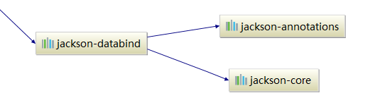

# Jackson的历史版本

## Jackson fasterxml和 codehaus的区别

**Jackson fasterxml和codehaus**是Jackson的两大分支、也是两个版本的不同包名。Jackson从2.0开始改用新的包名fasterxml；

1.x版本的包名是codehaus。除了包名不同，他们的Maven artifact id也不同。1.x版本现在只提供bug-fix，

而2.x版本还在不断开发和发布中。如果是新项目，建议直接用2x，即fasterxml jackson。

 

Jackson可以轻松的将Java对象转换成json对象和xml文档，同样也可以将json、xml转换成Java对象。

 

**fasterxml jackson**

三个主要的jar包：

- jackson-core：核心包

- jackson-annotations:注解包
- jackson-databind：数据绑定包

在Maven中的依赖关系：



所以只需要在项目中引入databind，其他两个就会自动引入

```
<dependency>
    <groupId>com.fasterxml.jackson.core</groupId>
    <artifactId>jackson-databind</artifactId>
    <version>2.1.0</version>
</dependency>
```

 

**codehaus**

主要的jar包　　　　

- jackson-core-asl.jar
- jackson-mapper-asl.jar

  在Maven中的依赖关系：


只需要引入 jackson-mapper-asl 的依赖就可以了　　

```
<dependency>
  <groupId>org.codehaus.jackson</groupId>
  <artifactId>jackson-mapper-asl</artifactId>
  <version>1.9.11</version>
</dependency>
```

 

#### 参考

1. [Jackson fasterxml和codehaus的区别 （fasterxml vs. codehaus）](https://www.cnblogs.com/leilong/p/8971385.html)